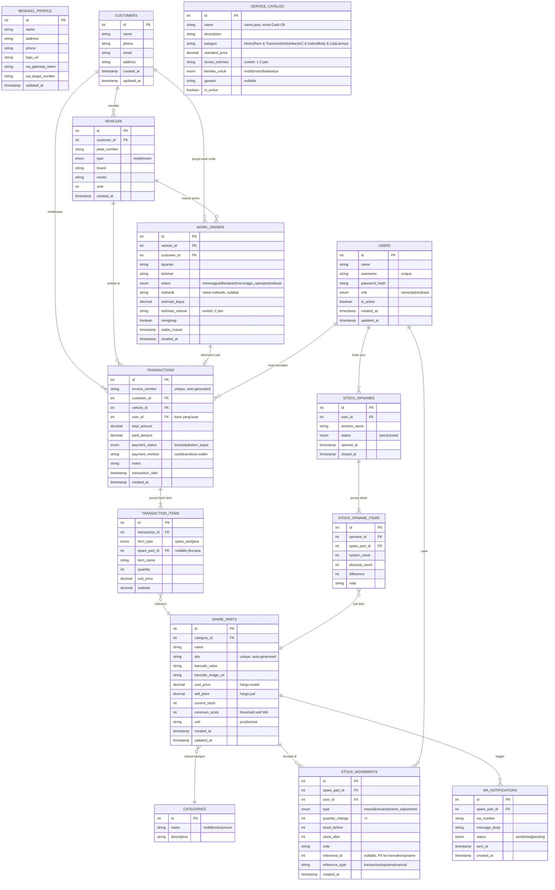

# ERD & Database Schema — AutoService Inventory Web Panel

> **Dokumen ini** adalah referensi desain database untuk PM (validasi ERD) dan BE Developer (implementasi).
> **Last Updated:** 2026-03-03

---

## Entity Relationship Diagram (ERD)



---

## Detail Schema per Tabel

### `users`

```sql
CREATE TABLE users (
  id            INT PRIMARY KEY AUTO_INCREMENT,
  name          VARCHAR(100) NOT NULL,
  username      VARCHAR(50) UNIQUE NOT NULL,
  password_hash VARCHAR(255) NOT NULL,
  role          ENUM('owner', 'admin', 'kasir') DEFAULT 'kasir',
  is_active     BOOLEAN DEFAULT TRUE,
  created_at    TIMESTAMP DEFAULT CURRENT_TIMESTAMP,
  updated_at    TIMESTAMP ON UPDATE CURRENT_TIMESTAMP
);
```

### `customers`

```sql
CREATE TABLE customers (
  id         INT PRIMARY KEY AUTO_INCREMENT,
  name       VARCHAR(150) NOT NULL,
  phone      VARCHAR(20),
  email      VARCHAR(150),
  address    TEXT,
  created_at TIMESTAMP DEFAULT CURRENT_TIMESTAMP,
  updated_at TIMESTAMP ON UPDATE CURRENT_TIMESTAMP
);
```

### `vehicles`

```sql
CREATE TABLE vehicles (
  id           INT PRIMARY KEY AUTO_INCREMENT,
  customer_id  INT NOT NULL,
  plate_number VARCHAR(20) UNIQUE NOT NULL,
  type         ENUM('mobil', 'motor') NOT NULL,
  brand        VARCHAR(100),
  model        VARCHAR(100),
  year         SMALLINT,
  created_at   TIMESTAMP DEFAULT CURRENT_TIMESTAMP,
  FOREIGN KEY (customer_id) REFERENCES customers(id) ON DELETE CASCADE
);
```

### `categories`

```sql
CREATE TABLE categories (
  id          INT PRIMARY KEY AUTO_INCREMENT,
  name        VARCHAR(100) NOT NULL,
  description TEXT
);
```

### `spare_parts`

```sql
CREATE TABLE spare_parts (
  id                INT PRIMARY KEY AUTO_INCREMENT,
  category_id       INT,
  name              VARCHAR(200) NOT NULL,
  sku               VARCHAR(50) UNIQUE NOT NULL,
  barcode_value     VARCHAR(100) UNIQUE,
  barcode_image_url VARCHAR(500),
  cost_price        DECIMAL(15,2) DEFAULT 0,
  sell_price        DECIMAL(15,2) DEFAULT 0,
  current_stock     INT DEFAULT 0,
  minimum_stock     INT DEFAULT 5,
  unit              VARCHAR(20) DEFAULT 'pcs',
  created_at        TIMESTAMP DEFAULT CURRENT_TIMESTAMP,
  updated_at        TIMESTAMP ON UPDATE CURRENT_TIMESTAMP,
  FOREIGN KEY (category_id) REFERENCES categories(id)
);
```

### `stock_movements`

```sql
CREATE TABLE stock_movements (
  id             INT PRIMARY KEY AUTO_INCREMENT,
  spare_part_id  INT NOT NULL,
  user_id        INT NOT NULL,
  type           ENUM('masuk', 'keluar', 'opname_adjustment') NOT NULL,
  quantity_change INT NOT NULL,
  stock_before   INT NOT NULL,
  stock_after    INT NOT NULL,
  note           TEXT,
  reference_id   INT,
  reference_type VARCHAR(50),
  created_at     TIMESTAMP DEFAULT CURRENT_TIMESTAMP,
  FOREIGN KEY (spare_part_id) REFERENCES spare_parts(id),
  FOREIGN KEY (user_id) REFERENCES users(id)
);
```

### `stock_opnames`

```sql
CREATE TABLE stock_opnames (
  id           INT PRIMARY KEY AUTO_INCREMENT,
  user_id      INT NOT NULL,
  session_name VARCHAR(200),
  status       ENUM('open', 'closed') DEFAULT 'open',
  opened_at    TIMESTAMP DEFAULT CURRENT_TIMESTAMP,
  closed_at    TIMESTAMP,
  FOREIGN KEY (user_id) REFERENCES users(id)
);
```

### `stock_opname_items`

```sql
CREATE TABLE stock_opname_items (
  id            INT PRIMARY KEY AUTO_INCREMENT,
  opname_id     INT NOT NULL,
  spare_part_id INT NOT NULL,
  system_stock  INT NOT NULL,
  physical_count INT DEFAULT 0,
  difference    INT GENERATED ALWAYS AS (physical_count - system_stock) STORED,
  note          TEXT,
  FOREIGN KEY (opname_id) REFERENCES stock_opnames(id),
  FOREIGN KEY (spare_part_id) REFERENCES spare_parts(id)
);
```

### `transactions`

```sql
CREATE TABLE transactions (
  id              INT PRIMARY KEY AUTO_INCREMENT,
  invoice_number  VARCHAR(50) UNIQUE NOT NULL,
  customer_id     INT,
  vehicle_id      INT,
  user_id         INT NOT NULL,
  total_amount    DECIMAL(15,2) DEFAULT 0,
  paid_amount     DECIMAL(15,2) DEFAULT 0,
  payment_status  ENUM('lunas', 'dp', 'belum_bayar') DEFAULT 'belum_bayar',
  payment_method  VARCHAR(50),
  notes           TEXT,
  transaction_date DATE NOT NULL,
  created_at      TIMESTAMP DEFAULT CURRENT_TIMESTAMP,
  FOREIGN KEY (customer_id) REFERENCES customers(id),
  FOREIGN KEY (vehicle_id) REFERENCES vehicles(id),
  FOREIGN KEY (user_id) REFERENCES users(id)
);
```

### `transaction_items`

```sql
CREATE TABLE transaction_items (
  id             INT PRIMARY KEY AUTO_INCREMENT,
  transaction_id INT NOT NULL,
  item_type      ENUM('spare_part', 'jasa') NOT NULL,
  spare_part_id  INT,
  item_name      VARCHAR(200) NOT NULL,
  quantity       INT DEFAULT 1,
  unit_price     DECIMAL(15,2) DEFAULT 0,
  subtotal       DECIMAL(15,2) DEFAULT 0,
  FOREIGN KEY (transaction_id) REFERENCES transactions(id) ON DELETE CASCADE,
  FOREIGN KEY (spare_part_id) REFERENCES spare_parts(id)
);
```

### `service_catalog`

```sql
CREATE TABLE service_catalog (
  id               INT PRIMARY KEY AUTO_INCREMENT,
  name             VARCHAR(200) NOT NULL,
  description      TEXT,
  kategori         VARCHAR(100),
  standard_price   DECIMAL(15,2) DEFAULT 0,
  durasi_estimasi  VARCHAR(50),
  berlaku_untuk    ENUM('mobil', 'motor', 'keduanya') DEFAULT 'keduanya',
  garansi          VARCHAR(100),
  is_active        BOOLEAN DEFAULT TRUE
);
```

### `work_orders`

```sql
CREATE TABLE work_orders (
  id               INT PRIMARY KEY AUTO_INCREMENT,
  vehicle_id       INT,
  customer_id      INT,
  layanan          VARCHAR(300) NOT NULL,
  keluhan          TEXT,
  status           ENUM('menunggu', 'dikerjakan', 'menunggu_sparepart', 'selesai') DEFAULT 'menunggu',
  mekanik          VARCHAR(100),
  estimasi_biaya   DECIMAL(15,2) DEFAULT 0,
  estimasi_selesai VARCHAR(50),
  menginap         BOOLEAN DEFAULT FALSE,
  waktu_masuk      TIMESTAMP DEFAULT CURRENT_TIMESTAMP,
  created_at       TIMESTAMP DEFAULT CURRENT_TIMESTAMP,
  FOREIGN KEY (vehicle_id) REFERENCES vehicles(id),
  FOREIGN KEY (customer_id) REFERENCES customers(id)
);
```

### `wa_notifications`

```sql
CREATE TABLE wa_notifications (
  id            INT PRIMARY KEY AUTO_INCREMENT,
  spare_part_id INT,
  wa_number     VARCHAR(20) NOT NULL,
  message_body  TEXT NOT NULL,
  status        ENUM('sent', 'failed', 'pending') DEFAULT 'pending',
  sent_at       TIMESTAMP,
  created_at    TIMESTAMP DEFAULT CURRENT_TIMESTAMP,
  FOREIGN KEY (spare_part_id) REFERENCES spare_parts(id)
);
```

---

## Catatan untuk BE Developer

1. **SKU Auto-Generate**: Format `AS-[CATEGORY_PREFIX]-[SEQUENCE]` (contoh: `AS-MOB-0001`)
2. **Invoice Number**: Format `INV-[YYYYMMDD]-[SEQUENCE]` (contoh: `INV-20260302-001`)
3. **Stock Guard**: Sebelum insert `stock_movements` dengan type `keluar`, selalu validasi `current_stock >= quantity_change`
4. **WA Trigger (WA Web.js)**: Setiap ada perubahan stok, BE wajib cek apakah `current_stock <= minimum_stock`. Jika ya, panggil `triggerWaNotificationIfNeeded()` dari `waClientService.ts` (bukan Fonnte/Wablas). Saat status Work Order berubah ke `dikerjakan`/`selesai`, panggil `sendServiceProgressNotification()` ke nomor pelanggan.
5. **Soft Delete**: Implementasikan `deleted_at` (soft delete) untuk `customers`, `spare_parts`, `users`, dan `work_orders` agar data historis tidak hilang
6. **WA Session**: Session WA Web.js disimpan di `.wwebjs_auth/` — pastikan folder ini **tidak** di-commit ke Git (tambahkan ke `.gitignore`)
7. **Arsitektur Hybrid WA**: REST API di-deploy ke Vercel (semua endpoint). WA Worker berjalan di **lokal** secara terpisah (`npm run wa:worker`). Vercel insert `pending` ke tabel `wa_notifications` → WA Worker polling DB setiap 15 detik → kirim via WA Web.js → update status `sent/failed`. Tidak perlu server dedicated.
